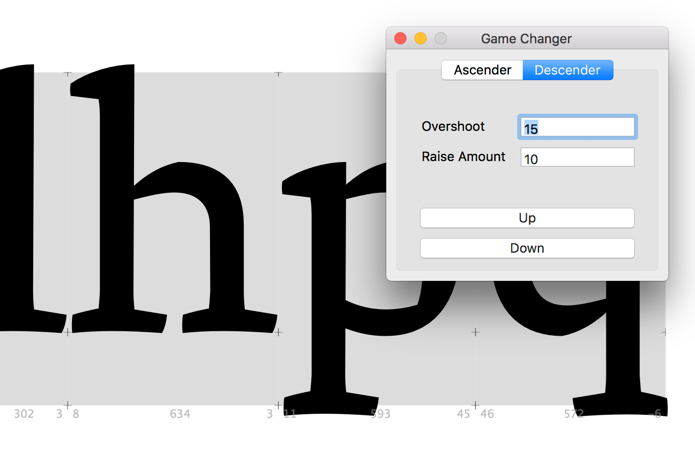
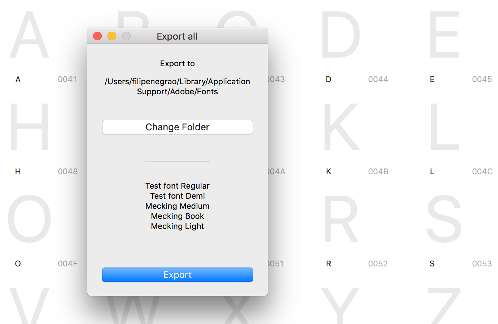
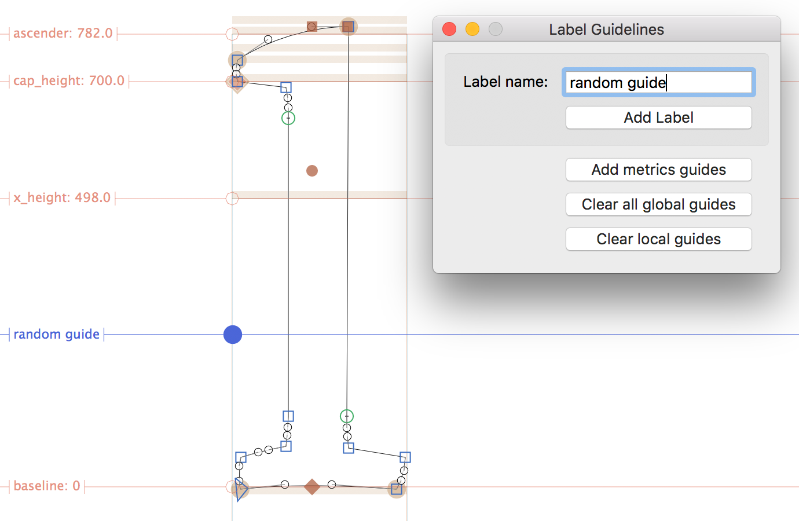

# About
A collection of useful (or not so useful) Glyphs App's scripts.

## Scripts:

- ### Change Ascenders & Descenders
(GUI) This code changes the height of ascenders or descenders of selected glyphs in Edit View. Vanilla required. Pro tip: Use Arrows Up and Down as shortcuts.

- ### Export all Open Fonts
(GUI) This script export all open fonts (instances inside fonts, to be precise) to a selected folder. The default folder is configured to ~/Library/Application Support/Adobe/Fonts. Vanilla required.

- ### Label Guidelines
(GUI) Label Guidelines was written to (obviously) add labels to Guidelines. Additionally, it has the option to delete all guides (local or global). Vanilla required.

- ### Slant Glyphs
(GUI) Based on based on Cyrus Highsmith and David Jonathan Ross's Italic Bowtie for Robofont, this tool is build to slant all selected glyphs in Edit View while adds a copy of the roman version in the background. It's not supposed to be an automatic italic solution but gives you a head start. Vanilla required. **Warning:** this script erases all the layers in the background that wore previously there. Comment the following line to avoid that: background_layer.paths = []

## Installation

Put the scripts inside the Scripts folder (Script > Open Scripts Folder or Cmd+Shift+Y). Then, hold down the Option key and choose Script > Reload Scripts (Cmd+Opt+Shift+Y). The scripts should appear in the Script menu.

All these tools required Vanilla to work. To install the Vanilla module, go to Glyphs > Preferences... > Add-ons > Modules > Install Modules
All these tools required Vanilla to work. To install the Vanilla module, go to  Glyphs > Preferences... > Add-ons > Modules > Install Modules

## Troubleshooting
Please report any issues or pull requests here in GitHub. Don't forget to indicate your OS X and Glyphs App version.

## Requirements
These scripts were tested using 2.5 and Mac OS 10.13. Should work on any Glyphs 2.x, but might requires some changes.

## License
Copyright (c) 2015–18 Filipe Negrão (@filipenegrao). It has some code samples by Georg Seifert (@schriftgestalt) and Rainer Erich Scheichelbauer (@mekkablue) that were posted in [Glyphs' App Forum] (https://glyphsapp.com/forum).

Licensed under the Apache License, Version 2.0 (the "License"); you may not use the software provided here except in compliance with the License. You may obtain a copy of the License at

http://www.apache.org/licenses/LICENSE-2.0

See the License file included in this repository for further details.
