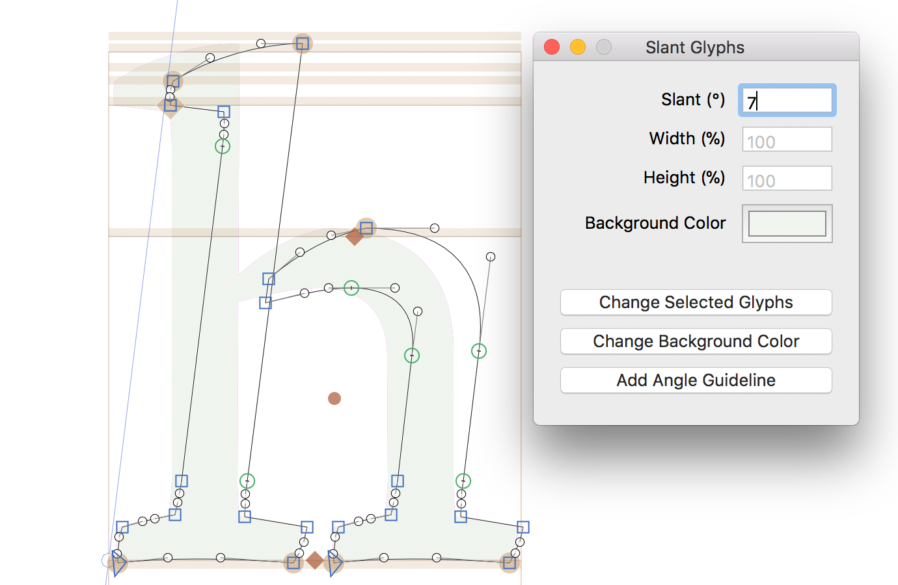

# About
This repository is a collection of useful (or not) Glyphs App scripts. Check out how some of then work on [Vimeo](https://vimeo.com/album/4932608).
Drop me a line if you need any help.

## Data Extractors
**Save vertical metrics data**: Save vertical metrics data: Takes the vertical metrics data and saves it in a .cvs file for further analysis. I wrote this to compare the data between typefaces of the same style.

## Diacritics & Combs
**Change the LSB and RSB for all comb glyphs**: Simply changes the metric values for comb marks. It is set by default at 50 units by default but can be modified for whatever you prefer (zero, maybe?). You just have to change the layer.LSB and layer.RSB values.

**Narrow diacritics maker (in progress)**: Duplicates "dieresiscomb", "gravecomb", "acutecomb", "brevecomb", "tildecomb", "macroncomb", "ogonekcomb", and a ".narrow" suffix.

**Open all comb marks in a new tab**: Opens all combs in a new tab based on their category (Mark) and subcategory (Nonspacing). It is as simple as that.

**Open all comb marks in a new tab**: Opens all the glyphs related to another glyph. E.g., select "Tilde" and run, and all the glyphs inside your font that has a tilde name on it will open.

**Delete all anchors from the current glyph:**: Removes all anchors from the currently selected glyph.

## Guides
**Label guidelines**: (GUI) Label Guidelines was written to add labels to Guidelines. Additionally, it has the option to delete all guides (local or global). Vanilla required.

## Italics
**Slant glyphs:** (GUI) Based on Cyrus Highsmith and David Jonathan Ross's Italic Bowtie for Robofont, this tool is built to slant all selected glyphs in Edit View while adding a copy of the Roman version in the background. It's not supposed to be an automatic italic solution but gives you a head start. Vanilla required. **Warning:** This script erases all the layers in the background that were previously there. Comment the following line to avoid that: background_layer.paths = []

## Kerning
**Create kerning groups for ligatures**: Search for all 'dligs' and set its kerning groups according to its reference glyphs.

**Important:** This script relies on Georg's script 'Diacritic Ligature Maker.py' so they must be together, like Siamese twins.
	 
## Paths
**Change ascenders & descenders:** Change Ascenders & Descenders: This code changes the height of ascenders or descenders of selected glyphs in Edit View. To do the script work properly, your overshoot parameter should be configured for, at least, the same as your highest overshoot (maybe I should have called this parameter "tolerance". Feel free to change that for me!)

**Pro tip:** Use the up and down arrows as shortcuts.

**Cut selection in half (horizontally)**: If a path is selected, it cuts the path in half. This is useful for designing symmetrical marks.

## Workflow
**Brand new day**: This script creates a new folder named the current date (Y-M-D format) with all the same stuff you have inside the existing file's folder, including Py scripts or anything you have on your glyphs file's folder. Then, the code closes the opened file and opens the new one. This is based on Hannes Famira's workflow, which was my type design instructors in Type@Cooper 2017.

**Brand New Day With Log**: The difference between this script and the previous one is that this creates and writes a log file (.md or .txt) on the root folder.

**Copy selected glyphs' names to the clipboard:**: Easily copy a selected glyph's name to the clipboard. This is useful for adding glyphs to your font later.

**Export all open fonts**: (GUI) This script exports all open fonts (instances inside fonts, to be precise) to a selected folder. The default folder is configured to ~/Library/Application Support/Adobe/Fonts. Vanilla is required.

**Export all open fonts to UFO**: This is for the folks who are into a UFO's workflow.

**Open selected glyphs in a new tab**: I've always found myself very annoyed by clicking some glyphs in the Font Panel and only one of them opens. I'm not sure if it is my inability or something else, but the idea behind this few lines is to open all the glyphs selected, regardless of your ability.
 
**Set color for current tab**: This script is all about creating an OPT-CMD-R shortcut for changing the color. Change R, G, B, A to your favorite color.

**Start a new project**: This is not a Glyphs App script per se. If you have the same folder structure for every project, this script creates that structure in a breeze. Just edit the folders list to change my current arrangement, which has the following subfolders: critiques, mockups, proofs, fonts, sources, research, data, sketches.

**Toggle enumerate nodes (from first to last)**: Toggle between with or without names in nodes by running the script and then pressing OPT + CMD + R.
Please note that the enumeration follows the contours direction, meaning: 
the node with the triangle (that indicates the first anchor) will be the #1.

**Toggle enumerate nodes (from "Glyphs order")**: Toggle between with or without names in nodes by running the script and then pressing OPT + CMD + R.
Please notice that the enumeration starts at the previous node as the first 'moveTo' operation on the path. More about this on [Glyphs Forum](https://forum.glyphsapp.com/t/order-of-nodes-starts-at-second-node/3737/3).

## Installation

### Option 1:
Put the scripts inside the scripts folder (Script > Open Scripts Folder or CMD + SHIFT + Y). Then, hold down the Option key and choose Script > Reload Scripts (CMD + OPT + SHIFT + Y). The scripts should appear in the Script menu.

### Option 2:
I consider this the ideal way of installation because it is easier to maintain the scripts up to date by merely fetching and pulling origin:

1. Clone this repository
1. Create an alias of the folder
1. Move the alias to Glyphs' scripts folder

**Important:** Some of those tools require Vanilla to work. To install the Vanilla module, go to Glyphs > Preferences... > Add-ons > Modules > Install Modules.

## Troubleshooting
Please report any issues or pull requests here in GitHub. Don't forget to indicate your OS X and Glyphs App version.

## Requirements
These scripts were tested using 2.5 and Mac OS 10.13. They should work on any Glyphs 2.x, but might requires some changes.

## License
Copyright (c) 2015–18 Filipe Negrão (@filipenegrao). It has some code samples by Georg Seifert (@schriftgestalt) and Rainer Erich Scheichelbauer (@mekkablue) that were posted in [Glyphs' App Forum] (https://glyphsapp.com/forum).

Licensed under the Apache License, Version 2.0 (the "License"); you may not use the software provided here except in compliance with the License. You may obtain a copy of the License at

http://www.apache.org/licenses/LICENSE-2.0

See the License file included in this repository for further details.
